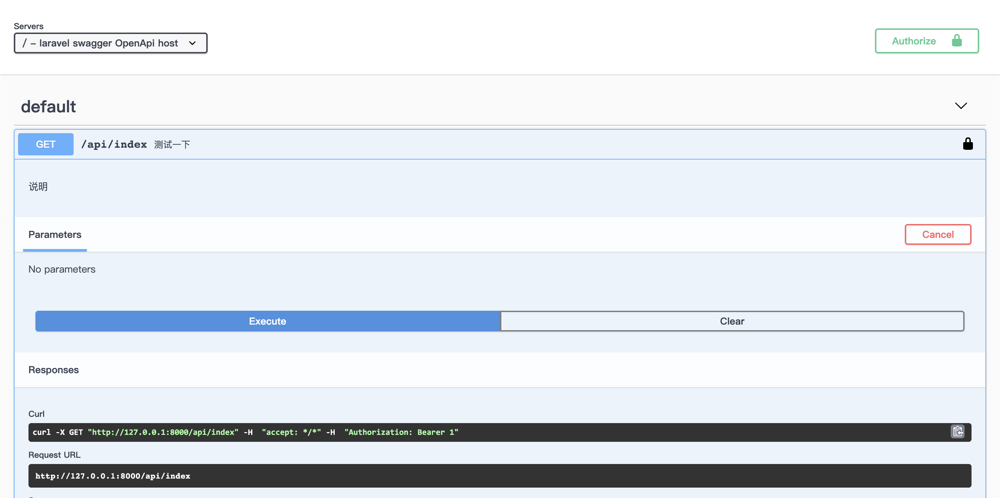

基于` zircote/swagger-php ` 和 ` swagger-ui ` 二次开发的自动生成OpenAPI文档的laravel扩展包
 
> [github地址](https://github.com/hanyunmuyu/laravel-swagger) 欢迎大家star和fork
 
 1、在laravel项目根目录执行 `composer require hanyun/swagger`
 
 2、执行 ` php artisan storage:link ` 发布静态资源
 
 3、执行 ` php artisan vendor:publish ` 发布扩展包的依赖文件
 
 ```

  [11] Tag: flare-config
  [12] Tag: ignition-config
  [13] Tag: laravel-errors
  [14] Tag: laravel-mail
  [15] Tag: laravel-notifications
  [16] Tag: laravel-pagination
  [17] Tag: swagger //这一行是我们的扩展包

```

输入 17 然后回车，应用我们的扩展包

4、执行 ` php artian make:controller Api/v1/IndexController ` 生成控制器，修改代码

``` php

<?php

namespace App\Http\Controllers\Api\v1;

use App\Http\Controllers\Controller;
use Illuminate\Http\Request;
use OpenApi\Annotations as OA;

class IndexController extends Controller
{
    //
    /**
     * @OA\Get(
     *     path="/api/index",
     *      security={{"bearerAuth":{}}},
     *     @OA\Response(response="200", description="
     *      |参数|说明|备注||||
     *      |:---:|:---:|:---:|-----|-----|-----|
     *      |status|状态|['已取消', '等待付款', '下单成功', '付款中'] 取数组索引||||
     *     ")
     * )
     */
    public function index(Request $request)
    {
        return $request->all();
    }
}


```

修改 ` App\Http\Controllers\Controller.php ` 代码如下

``` php

<?php

namespace App\Http\Controllers;

use Illuminate\Foundation\Auth\Access\AuthorizesRequests;
use Illuminate\Foundation\Bus\DispatchesJobs;
use Illuminate\Foundation\Validation\ValidatesRequests;
use Illuminate\Routing\Controller as BaseController;
use OpenApi\Annotations as OA;


/**
 * @OA\OpenApi(
 *     @OA\Info(
 *         version="1.0.0",
 *         title="Swagger Petstore",
 *         description="This is a sample server Petstore server.  You can find out more about Swagger at [http://swagger.io](http://swagger.io) or on [irc.freenode.net, #swagger](http://swagger.io/irc/).  For this sample, you can use the api key `special-key` to test the authorization filters.",
 *         termsOfService="http://swagger.io/terms/",
 *         @OA\Contact(
 *             email="apiteam@swagger.io"
 *         ),
 *         @OA\License(
 *             name="Apache 2.0",
 *             url="http://www.apache.org/licenses/LICENSE-2.0.html"
 *         )
 *     ),
 *     @OA\Server(
 *         description="OpenApi host",
 *         url="https://petstore.swagger.io/v3"
 *     ),
 *     @OA\ExternalDocumentation(
 *         description="Find out more about Swagger",
 *         url="http://swagger.io"
 *     )
 * )
 * @OA\SecurityScheme(
 *      securityScheme="bearerAuth",
 *      in="header",
 *      name="Authorization",
 *      type="http",
 *      scheme="Bearer",
 *      bearerFormat="JWT",
 * )
 */
class Controller extends BaseController
{
    use AuthorizesRequests, DispatchesJobs, ValidatesRequests;
}

```

5、修改 ` config/swagger.php ` 这个会自动覆盖swagger的默认配置信息

6、在项目根目录执行 ` php artisan swagger:generate `，生成API

7、项目根目录执行 `  php artisan serve `，打开 [项目文档](http://127.0.0.1:8000/swagger)

8、jwt认证

```

curl -X GET "http://127.0.0.1:8000/api/index" -H  "accept: */*" -H  "Authorization: Bearer 111"

```

具体的[swagger文档](https://swagger.io/) ，[zircote/swagger-php文档](https://github.com/zircote/swagger-php)

> [github地址](https://github.com/hanyunmuyu/laravel-swagger) 欢迎大家star和fork
